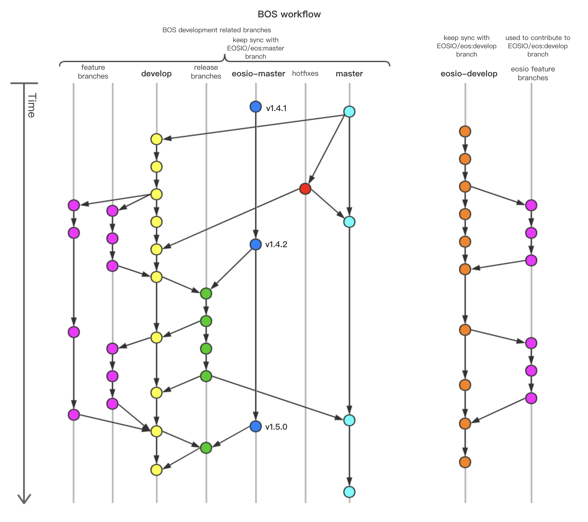

# BOSCore - Born for DApps. Born for Usability.

## BOSCore Version: v3.0.4
### Basic EOSIO Version: v1.6.6 (support REX, part 1.8.x)

# Background
The emergence of EOS has brought new imagination to the blockchain. In just a few months since the main network was launched, the version has undergone dozens of upgrades, not only the stability has been greatly improved, but also the new functions have been gradually realized. The node team is also actively involved in building the EOSIO ecosystem. What is even more exciting is that EOS has attracted more and more development teams. There are already hundreds of DApp running on the EOS main network. The transaction volume and circulation market value far exceed Ethereum, and the space for development is growing broader.
During the gradual development of the EOS main network, we found some deviations from expectations. As the most competitive third-generation public chain, we look forward to seeing more and more applications running on EOS. Developers will use EOS as their preferred platform for application development. But due to the limitations of the current EOS resource model, higher cost of use including creating more accounts for users and deploying operating DApp. The key technology IBC needed for the millions of TPS to be realized in the white paper has not been promoted. The main network has repeatedly experienced insufficient CPU computing resources, which has intensified the urgency of the demand for cross-chain communication. In addition, due to the Pipeline-DPOS consensus algorithm adopted by EOSIO, a transaction takes nearly three minutes to ensure that it cannot be changed. Although it is much better than Bitcoin and Ethereum, it also brings restrictions to a lot of EOS application scenarios. Fast payment can only focus on small transfers, large transfers must wait long enough to ensure that they cannot be changed, which limits the payment experience of users on the chain and under the chain.
In addition to the above mentioned, there are many other improvements that have been actively discussed in our community. From this, we feel that we should try more on EOS and let more developers or teams participate in the construction of EOSIO ecosystem. we will together make efforts for the blockchain to land in different scenarios in different industries. As a fully community-maintained EOS side chain, BOS will make more attempts based on its inherited good functions and will feed back to the EOSIO ecosystem its proven new features and functions.

# Overview
BOS is committed to providing users with easy-to-access and easy-to-use blockchain services, providing a more user-friendly infrastructure for DApp operations, working to support richer application scenarios, and actively experimenting with DApp booms. In addition to technical improvements, BOS will also try other aspects. For example, in order to increase the participation of users in voting, estimator technology can be used to motivate accounts that meet clear rules. The rewards of BP on BOS will be adjusted according to the number of DApp on the chain, TPS, market value, liquidity and other indicators. Each BP is an encouragement for providing more resources for the ecology. A resolution reached by a community referendum will be coded as much as possible, to reduce human factors in the process, keep the process on chain, and maintain fairness and transparency.
The codes of the BOS chain are fully contributed and maintained by the community. Each ecological participant can submit codes or suggestions. The related process will refer to existing open source software, such as PEP (Python Enhancement Proposals).
In order to encourage the development of DApp in BOS, the BOS Foundation will provide Token replacement of low-cost resource mortgage services for DApp in BOS, reduce the operating costs of DApp in the early stage; in addition, it will also regularly provide BOS incentives to developers who contribute on a regular basis in order to establish a mutually reinforcing community development trend.

# Developer Rewards 

An additional 0.8% issuance will be given to the BOS eco-contribution code developer every year. Fifty candidates will be nominated by the community. Top 50 BPs vote 40 winners to get the awards: the top 10 share 40%, people ranked 11 to 20 share 30%, the last 20 share the remaining 30% evenly. The reward happens once every 3 months and each reward will be carried out with a one-week publicity. It will be re-evaluated if there is a reasonable objection. And each reward list will be recorded on chain. 
As BOS continues to develop, developer rewards will be appropriately adjusted to allow the community to provide more momentum for the evolution of BOS. 

## Links
1. [Website](https://boscore.io)
2. [Developer Telegram Group](https://t.me/BOSDevelopers)
3. [Community Telegram Group](https://t.me/boscorecommunity)
4. [WhitePaper](https://github.com/boscore/Documentation/blob/master/BOSCoreTechnicalWhitePaper.md)
5. [白皮书](https://github.com/boscore/Documentation/blob/master/BOSCoreTechnicalWhitePaper_zh.md)

## Start
1. Build from code : `bash ./eosio_build.sh -s BOS`
2. Docker Style，check [Docker](./Docker/README.md)

## Tips:
- HTTP&P2P endpoints can be get from the [validator](https://validate.eosnation.io/bos/reports/endpoints.html) by EOS Nation
- BOS Mainnet [genesis.json](https://github.com/boscore/bosres/blob/master/genesis.json)
- BOS Mainnet [Genesis](https://github.com/boscore/bosres/blob/master/BOS_Genesis.md)
- EOS Mainnet [snapshot](https://github.com/boscore/bos-airdrop-snapshots/blob/master/README.md)

## BOSCore Workflow
BOSCore encourage community developer actively participate in contributing the code, members should follow the workflow below.

Attention: 
1. Only allow Feature Branch or bug fix to submit PR to Develop Branch.
2. Rebase is required before submitting PR to Develop Branch.
3. Treat update of eosio/eos code as new feature.
4. Emergent issues must repaired by adopting hotfixes mode.

BOSCore bases on EOSIO, so you can also referer:

[Getting Started](https://developers.eos.io/eosio-nodeos/docs/overview-1)  

[EOSIO Developer Portal](https://developers.eos.io).

